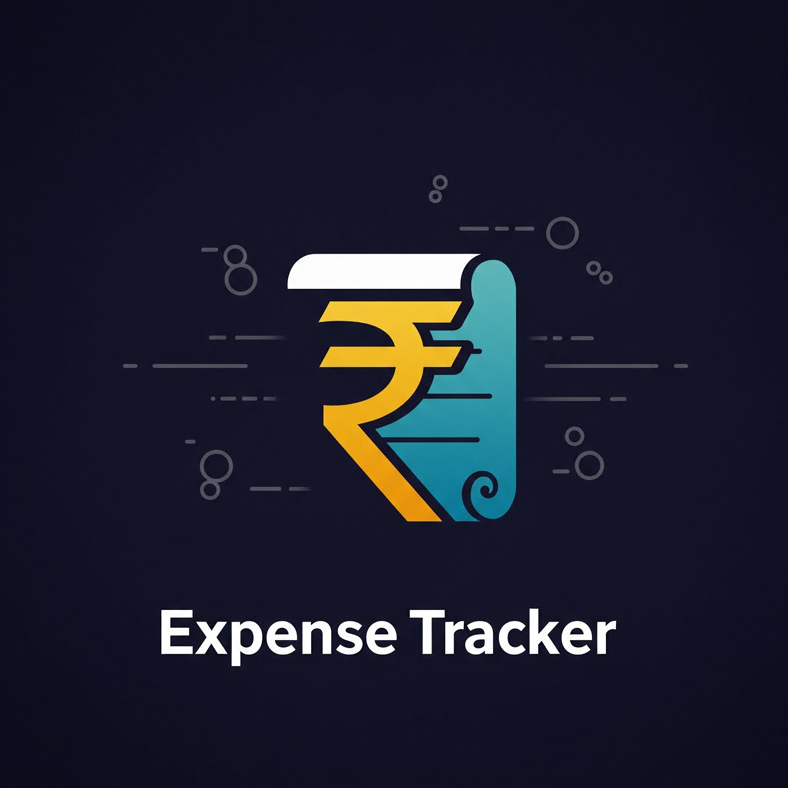

# Rupee-Route



A personal expense tracker to manage your finances effectively.

## Features

*   **Dashboard:** Get a quick overview of your finances.
*   **Expense Tracking:** Add, view, edit, and delete your daily expenses.
*   **Income Management:** Keep track of your income sources.
*   **Investment Tracking:** Monitor your investments.
*   **Budgeting:** Set monthly budgets for different expense categories.
*   **Reports:** Generate reports to analyze your spending habits.

## Technologies Used

*   **Frontend:** HTML, CSS, JavaScript, jQuery, Bootstrap, Chart.js
*   **Backend:** PHP
*   **Database:** MySQL

## Setup and Installation

To get a local copy up and running, follow these simple steps.

### Prerequisites

*   A web server environment like [XAMPP](https://www.apachefriends.org/index.html) or WAMP.

### Installation

1.  **Clone the repo**
    ```sh
    git clone https://github.com/your_username_/Project-Name.git
    ```
2.  **Move the project to your server's root directory** (e.g., `htdocs` in XAMPP).
3.  **Import the database schema**
    *   Open `phpMyAdmin`.
    *   Create a new database named `expense_tracker`.
    *   Import the `sql for expense tracker.txt` file into the `expense_tracker` database.
4.  **Configure the database connection**
    *   Open `db_connect.php`.
    *   Update the database credentials if they are different from the default XAMPP settings.
    ```php
    <?php
    $host = "localhost";
    $username = "root";
    $password = "";
    $database = "expense_tracker";
    ?>
    ```

## Usage

*   Open your web browser and go to `http://localhost/your_project_folder_name/`.
*   You will be greeted with the dashboard, which shows a summary of your finances.
*   Use the navigation bar to access different sections like 'Add Expense', 'View Expenses', 'Manage Income', etc.

## Screenshots

*(Here you can add screenshots of your application to showcase its features.)*

**Dashboard:**


**Add Expense Page:**


**View Expenses Page:**


**Reports Page:**


## Contributing

Contributions are what make the open-source community such an amazing place to learn, inspire, and create. Any contributions you make are **greatly appreciated**.

1.  Fork the Project
2.  Create your Feature Branch (`git checkout -b feature/AmazingFeature`)
3.  Commit your Changes (`git commit -m 'Add some AmazingFeature'`)
4.  Push to the Branch (`git push origin feature/AmazingFeature`)
5.  Open a Pull Request

Please make sure to update tests as appropriate.

## License

Distributed under the MIT License. See `LICENSE` for more information.
